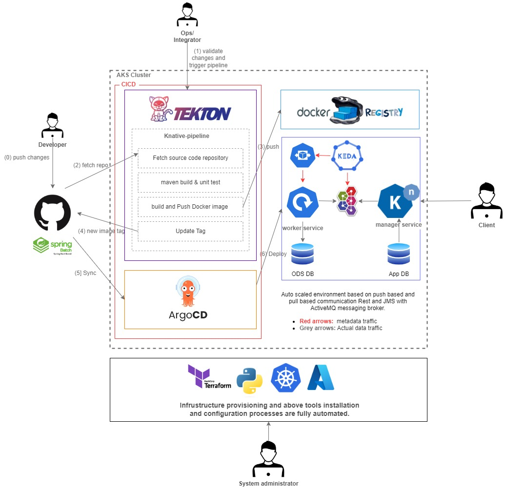

# Policy Extract, Transform, and Load (ETL) Serverless Function with Event-Driven Autoscaling and Modern CI/CD

## Overview
This project explores the challenges of integrating event-driven solutions—particularly batch jobs—into a microservices architecture. The objective is to design a robust Continuous Integration and Continuous Deployment (CI/CD) platform capable of dynamically scaling resources to meet demand.

While microservices architecture excels at building complex systems by decoupling functionality into independent services, seamlessly incorporating event-driven solutions within this paradigm demands a cloud-native strategy. This approach must address the entire lifecycle, from development to deployment, ensuring scalability, compatibility, and maintainability.

In this report, we delve into the process of constructing a Kubernetes-native deployment platform tailored for batch jobs in the cloud. The solution emphasizes tackling integration challenges and offers a practical roadmap for implementing batch processing within microservices, complete with an event-driven autoscaling mechanism.
